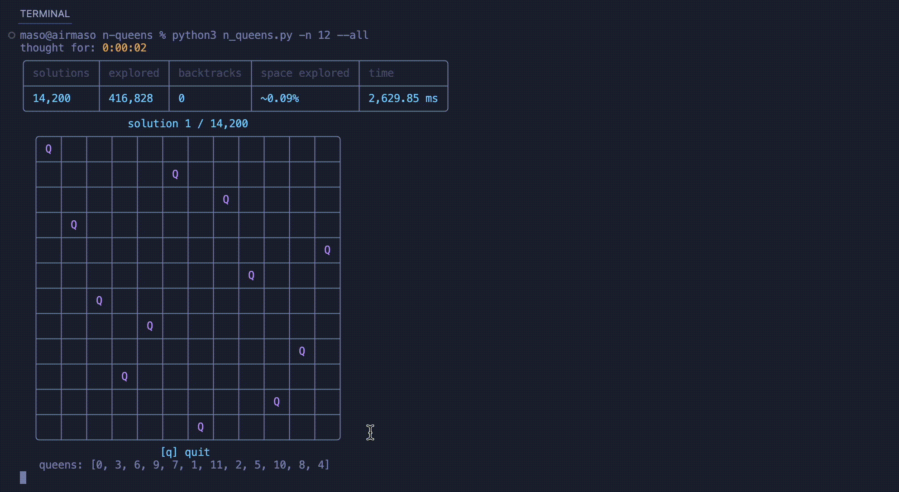
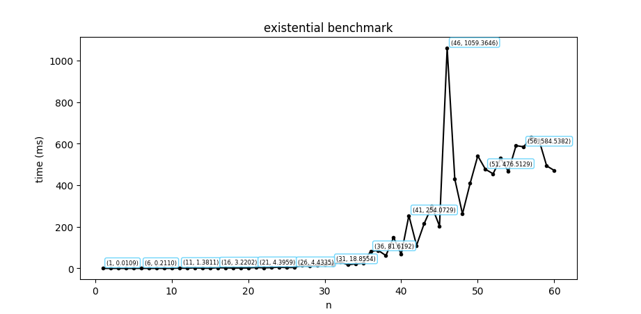
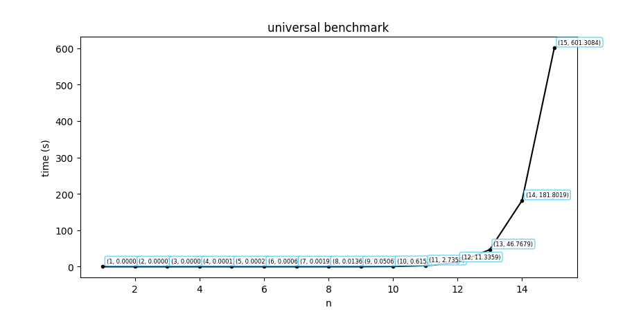

# n-queens

An optimized N-queens solver using minimum remaining values (MRV) + least-constraining-value (LCV) heuristics.

<p align="center">
    
</p>

## Setup
```sh
pip install -r requirements.txt
```

## Usage
```
python n_queens.py --help
usage: n_queens [-h] -n N [-a]

An optimized n-queens solver that utilizes mrv+lcv heuristics

options:
  -h, --help   show this help message and exit
  -n N, --n N  the number of queens
  -a, --all    whether to find all possible solutions
```

```sh
python n_queens.py -n 8        # find one solution
```

```sh
python n_queens.py -n 8 --all  # find all solutions
```

## Benchmarks
<p align="center">
    
    
</p>

To run benchmarks locally:
```sh
python -m utils.benchmark
```
